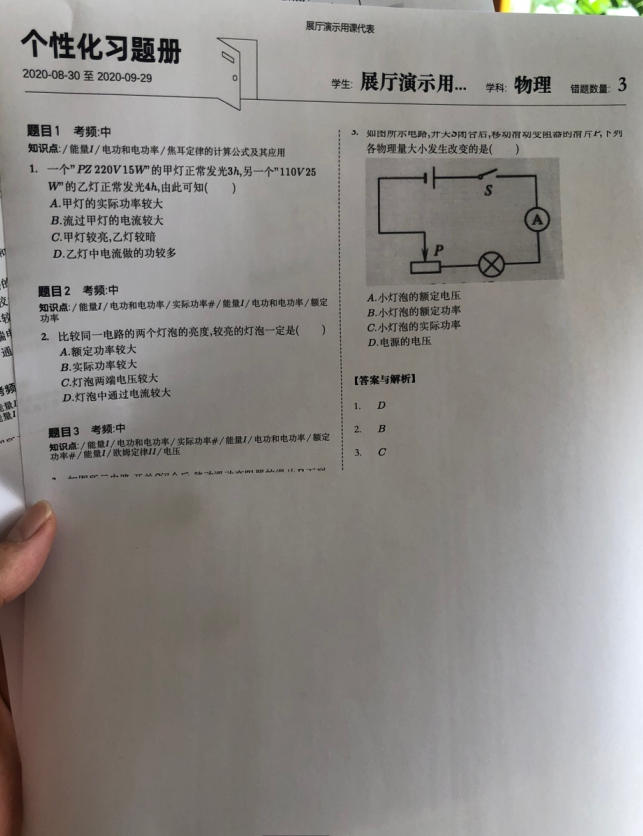

一、可用方法：
1. word-break 字断
1. overflow-wrap 溢出包装
1. word-wrap（overflow-wrap的别名）
1. text-overflow 文本溢出
1. white-space 空白
1. line-break 越线

二、具体介绍：
1. word-break
     -  指定了怎样在单词内断行，规定浏览器是否在即将溢出的文本处插入分词符
     - 取值：`normal | break-all | keep-all | break-word(不再维护)`
     - 注意：`word-break:break-word`是`word-break:normal`和`overflow-wrap:anywhere`的合
1. overflow-wrap
     - 为防止文本溢出，指定浏览器是否向语句中插入换行符
     - 取值：`normal | break-word(功能类似work-break:break-word) | 
anywhere(兼容性一般)`
     - 注意：`word-break` 指定了怎样在单词内断行，`overflow-wrap`仅在当一个不能被分开的字符串太长，为防止其溢出，浏览器是否允许这样的单词中断换行。
1. text-overflow
    - 确定未显示的溢出内容如何表达
    - 取值：`clip | ellipsis | fade(实验中) | <string>(实验中)`
1. white-space
    - 如何处理元素内的空白
    - 取值：`normal | nowrap | pre-line | pre-wrap | pre-line` 
    - 参考：http://www.ruanyifeng.com/blog/2018/07/white-space.html
1. line-break
    - 实验技术，可以用来处理如何断开带有标点符号的中文、日文或韩文（CJK）文本的行。
    - 取值：`auto | loose | normal | strict | anywhere`

三、其他相关属性
1. break-after
   - 分割容器后面栏或页
   - 取值(常用)：`auto | avoid | avoid-column | avoid-page | column | page`
1. break-before
   - 分割容器前面栏或页
   - 取值(常用)：`auto | avoid | avoid-column | avoid-page | column | page`
1. break-inside
   - 容器内断裂方式
   - 取值：`auto | avoid |avoid-column | avoid-page`

四、项目遇到的问题
1. 双栏最后一页内容不够一栏时，平分了内容

   - 解决：在分栏的div里面加一层包裹用属性`break-inside`表明内部不被割裂。
1. 双栏左侧内容很少时没有分栏线
    - 解决：设置`min-height`为一页纸高度，让最小高度超过一栏，就可以出现分栏线。 
2. 学生之间插入一张空白页，防止正反面打印时不同学生出现在一张纸上
    - 解决：建一个div，设置`break-before:page`，让他独占
3. html题目内容里有`&nbsp`(Non Breaking Space)不间断空格，所以会有可能溢出外框
    - 解决：设置`word-break:break-word`

